# Logi-KafkaGateway 相关实现概述

## 1、前言

本次分享，首先会简单的回顾一下`Logi-Kafka`相关模块之间的交互流程以及作用。然后会对其中涉及到的`Logi-KafkaGateway`相关的模块再简单串讲一下实现方式。期望通过这次分享，能使得我们对整个`Logi-KafkaGateway`有一个全局的认识。

## 2、Logi-Kafka 服务概述

在具体的介绍`Kafka-Gateway`之前，我们再来回顾一下`Logi-Kafka`云平台模块之间的交互。

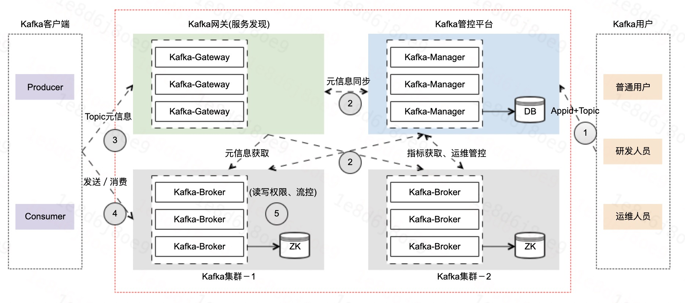

平台管控侧
- **第一步**：用户在`Kafka管控平台`上进行接入集群、创建应用、创建Topic等操作，操作完成之后，一些元信息会被存储在`Kafka管控平台`的DB里面。

- **第二步**：`Kafka服务发现` 以及 `Kafka集群` 会定时请求`Kafka管控平台`获取相关的元信息，这里元信息包括应用信息(用户信息)、权限信息、集群的服务地址以及服务发现的动态配置信息。

客户端使用侧
- **第三步**：客户端首先会请求`Kafka服务发现`获取Topic的元信息等，`Kafka服务发现`会将请求转发到`Kafka集群`并在获取到元信息之后，直接返回给客户端。
- **第四步**：客户端在获取到Topic的元信息后，会往`Kafka集群` Topic所在的Broker进行发送/消费。
- **第五步**：`Kafka集群`在收到客户端的发送/消费请求之后，会进行读写的权限管控以及流控。

以上就是整个Kafka服务的流程，其中涉及到`Kafka-Gateway`相关的模块有：

- Kafka管控平台；
- Kafka网关 —— Kafka服务发现；
- Kafka集群 —— 安全管控；
- Kafka集群 —— 流量管控；

下面将开始讲解`Kafka服务发现`、`安全管控`和`流量管控`三个模块，其中`Kafka管控平台`这块因为之前已进行分享，因此本次不进行介绍。

## 3、服务发现

服务发现是一个具备 **统一元数据管理** 以及一定的 **请求降级** 能力的组件。他完全支持Kafka消息协议，但是不作为一个`Kafka-Server`去存储客户端发送过来的数据，即服务发现仅能处理Kafka的部分请求，可以简单的将其理解为是一个半真的Kafka-Broker。

### 3.1、功能流程概述

在介绍具体的功能之前，我们先来看一下服务发现和其他模块的交互。

- **第一步**：`Kafka服务发现`定时请求`Kafka管控平台`获取相关的信息，这里的信息主要是各个Kafka集群的服务地址，然后还有给服务发现使用的相关配置，具体的可以看`Kafka管控平台`里面的`gateway_config`表。

- **第二步**：客户端启动之后首先会请求`Kafka服务发现`获取相关的集群信息。这块信息包括说`Topic元信息`、`GroupCoordinator地址`、使用的`API版本`以及`初始化ProducerId`。PS：服务发现仅接收`METADATA`、`FIND_COORDINATOR`、`API_VERSIONS`和`INIT_PRODUCER_ID`这四个请求。

- **第三步**：服务发现在收到客户端请求之后，会将请求转发到具体的集群进行处理，并将处理的结果返回给客户端。比如客户端收到了Topic元信息之后，那么客户端就会连接Topic实际所在的Broker进行生产和消费，通常就不会再将请求发送到服务发现了。

### 3.2、大体实现说明

服务发现请求`Kafka管控平台`具体的接口都在`com.xiaojukeji.kafka.manager.web.api.versionone.gateway`包下面的`GatewayServiceDiscoveryController`类里面，都是一些HTTP请求，比较简单可以直接看代码，因此不再做更多说明。

下面讲解一下服务发现对客户端发送过来的请求的处理过程：

**步骤一：收到客户端请求**

因为完整的端到端的请求过程和Kafka本身一致，这里就直接切入代码关键的位置开始说明。端到端完整的请求过程在后续的分享中会进行分享。

**步骤二：请求入队列**

**步骤三：异步线程取队列数据并将请求转发到Kafka集群**

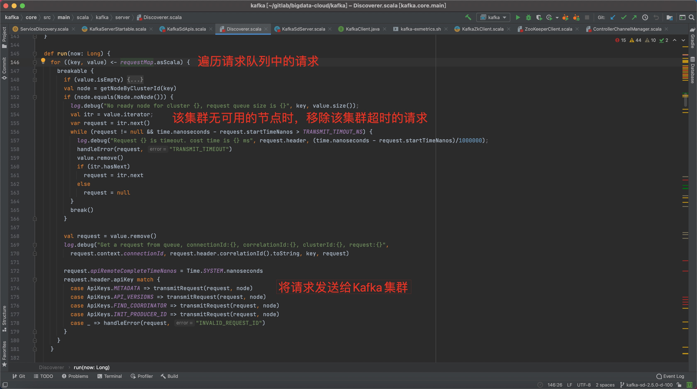

**补充说明：gateway_config表的配置对应生效的地方**

以上就是服务发现相关的内容。

## 4、安全管控

上一节介绍了Kafka服务发现相关的内容，本节介绍一下安全管控这块的内容。首先说明一下，安全管控相关的代码都是在`Kafka-Broker`中。下面我们正式开启安全管控相关的介绍。

### 4.1、功能流程概述

安全管控，顾名思义，主要功能就是进行用户权限的检查。还是老样子，在介绍具体的功能之前，我们先来回忆一下安全管控和其他模块的交互。

- **第一步**：用户认证及用户鉴权模块都会请求`Kafka管控平台`去获取用户信息和权限信息。
- **第二步**：客户端在服务发现获取到Topic的元信息之后，会往真正的Topic所在的`Kafka-Broker`生产或消费数据。
- **第三步**：`Kafka-Broker`会和Kafka客户端建立连接通道，并进行一些处理。
- **第四步**：`Kafka-Broker`在连接通道的建立过程中会检查用户是否已认证，如果没有认证则会调用`Kafka-Gateway`的认证模块进行认证。
- **第五步**：`Kafka-Broker`在认证通过之后，会读取连接通道中数据，然后交给后面的业务IO线程(前面是在网络IO线程)进行处理。
- **第六步**：`Kafka-Broker`的业务IO线程在处理的时候，会先调用`Kafka-Gateway`的鉴权模块进行鉴权。
- **第七步**：鉴权成功之后，如果是一个Produce请求，则进行写入数据相关的操作。如果是Fetch请求，则进行拉取数据相关的操作。操作完成之后返回操作结果。

这样整个流程就讲完了，这里额外说明一下，虽然上面按照顺序说了步骤一、二、三等等，但是实际上步骤一和剩下的几个步骤是同时进行的。

介绍完整个流程之后，下面我们具体讲一下`用户认证`和`用户鉴权`的一些实现细节及代码位置。

### 4.2、用户认证

滴滴的用户认证功能是基于Kafka原生的认证进行扩展实现的。原生相关的实现相关代码可以看下图，有兴趣的大家可以看一下具体的代码。本次直接讲滴滴内部基于该能力做的扩展的部分。

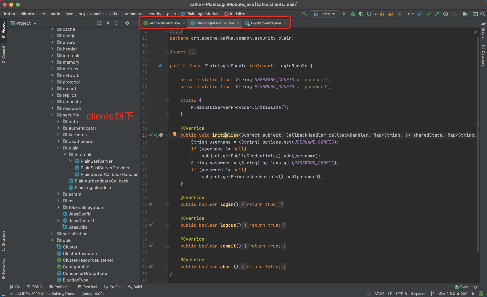

我们以一次认证的完整过程来看一下滴滴内部在认证这块的扩展部分的实现：

**步骤一：处理客户端请求**

**步骤二：开始进入认证模块**
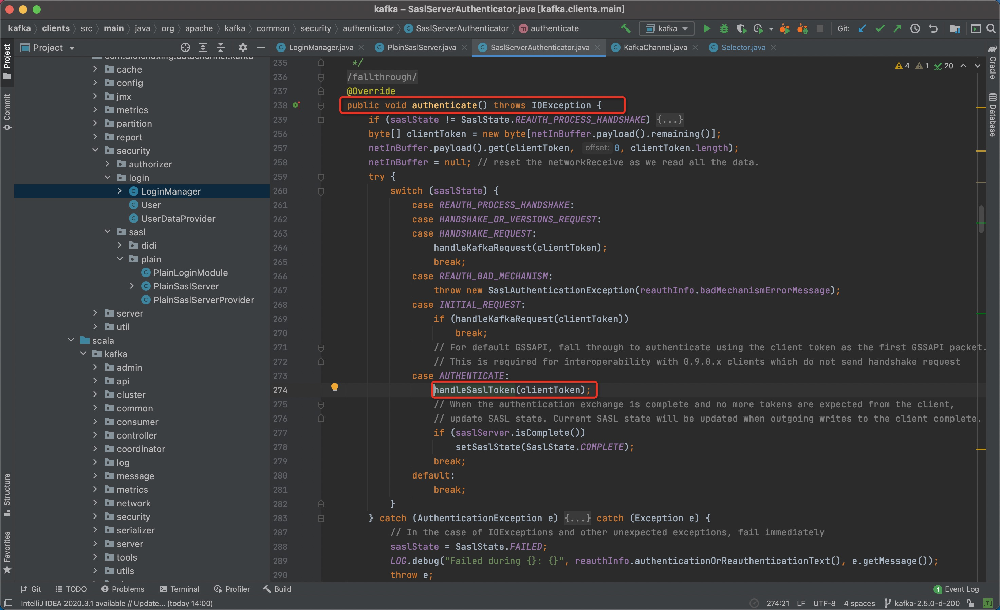

**步骤三：调用滴滴实现的认证接口**
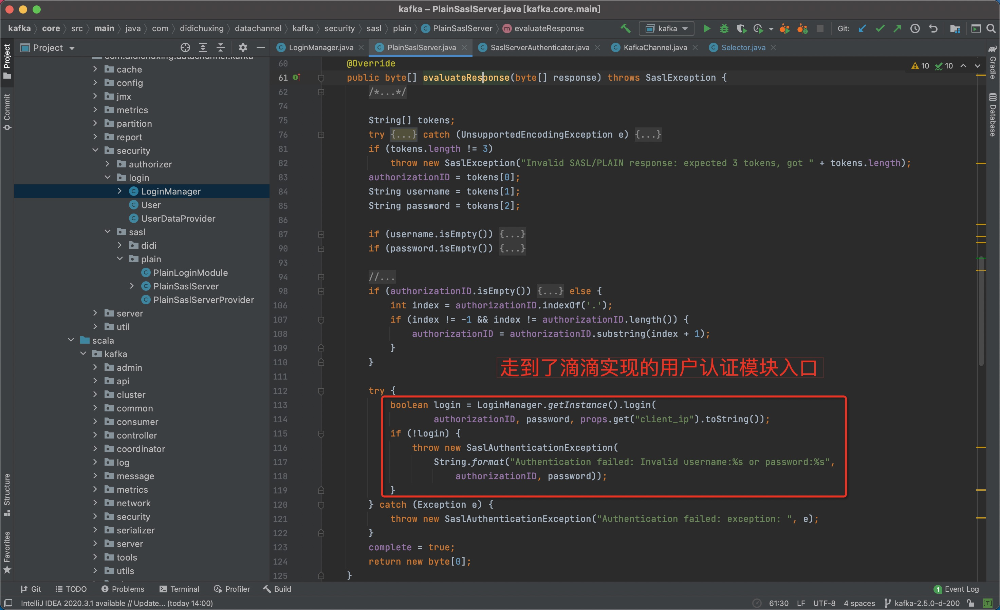

**步骤四：认证相关的代码**

&nbsp;

**LoginManager简介**

刚才我们看到`步骤四`最后调用了`LoginManager`里面的`login()`方法来进行用户合法性的判断。

`LoginManager`本身是单例实现，看`LoginManager`的源码，我们会发现内部除了`login()`方法之外呢，还会有一个`DataCache`的实例化对象，该对象在这里是用来管理用户信息的。

`DataCache`，就如其名字一样，是一个数据缓存模块，在整个安全管控功能中，是一个非常重要的模块，这个我们放到本章的最后单独介绍。

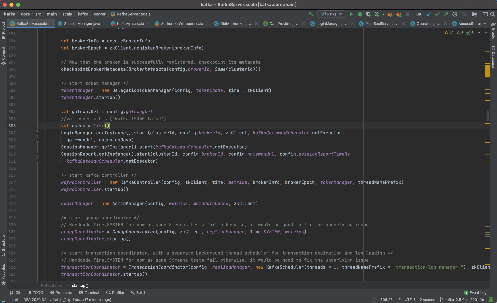

&nbsp;

### 4.3、用户鉴权

鉴权也是基于社区原生的Kafka做的扩展，我们以Produce请求的权限验证过程来了解一下用户鉴权的全流程。

**步骤一：开始对Produce请求进行鉴权**

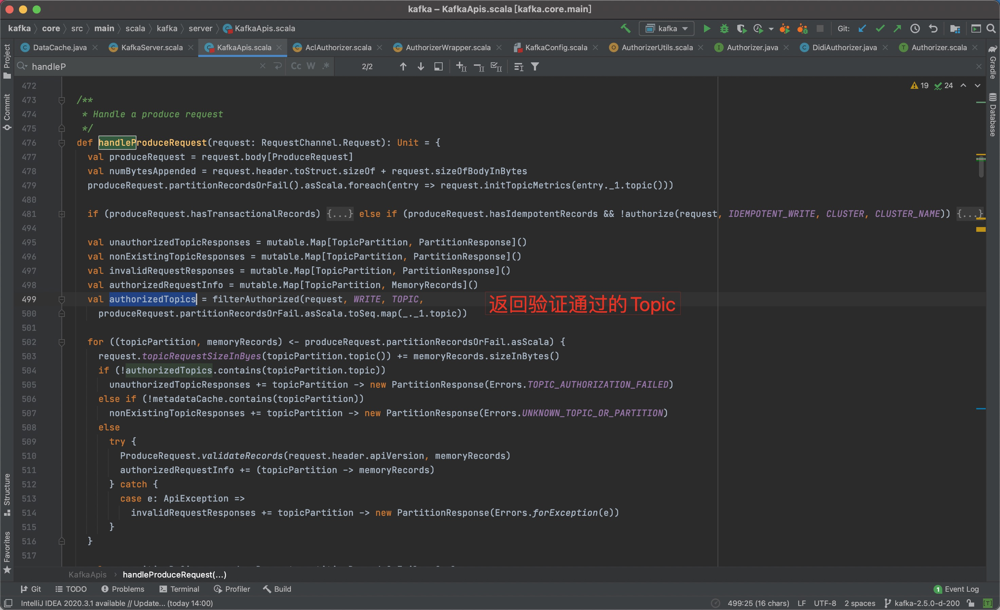

**步骤二：调用滴滴实现的鉴权接口**

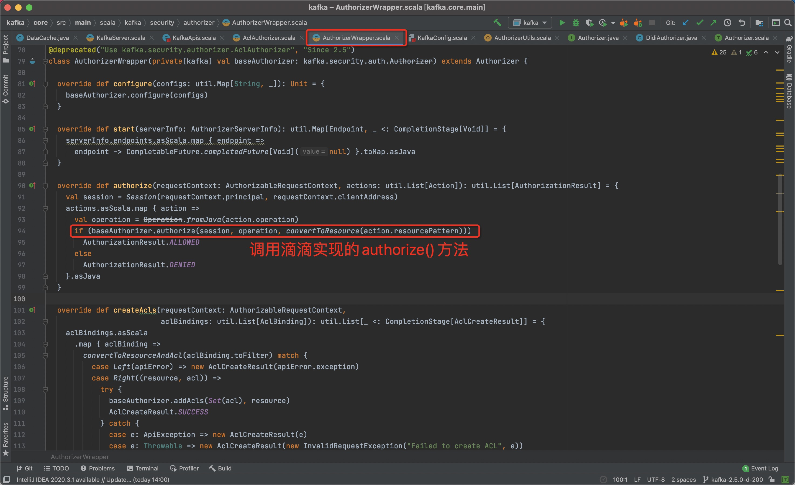

**步骤三：滴滴鉴权接口进行鉴权**

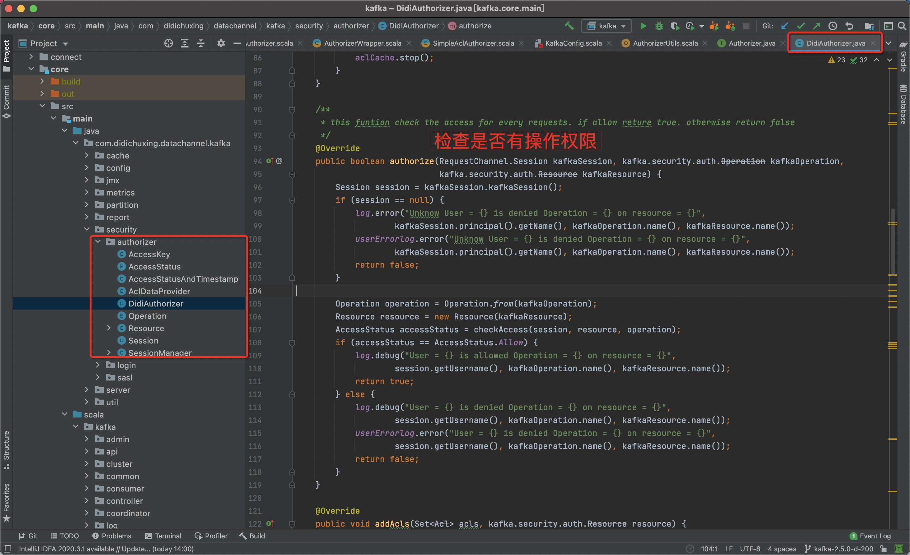

&nbsp;

**DidiAuthorizer补充说明**

刚才我们看到`步骤三`最后调用了`DidiAuthorizer`里面的`authorize()`方法来进行权限的判断。

那么鉴权这块，有什么特殊的设计呢？比如超级管理员什么的？

答案是有的，我们直接看代码：

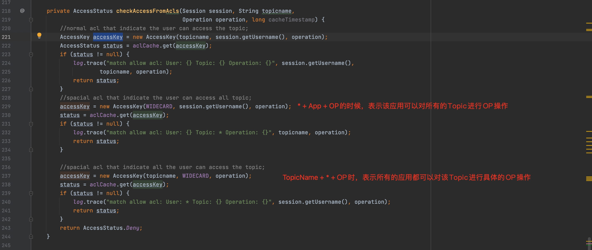

&nbsp;

### 4.4、`DataCache`(缓存管理)

至此，用户认证和用户鉴权在功能上大体都分享好了。但是在分享的时候，我们提到有个`DataCache`模块会对用户信息及权限信息进行维护。现在我们开始概要介绍一下`DataCache`相关的内容。

#### 4.4.1、`DataCache`简介

在`Kafka-Gateway`功能开发中用户登录验证与权限验证这些功能均需要在所有`Broker`上对操作进行验证。这些验证操作的数据都存储在数据库。

由于几乎每个请求都要进行验证，如果每次操作都访问数据库，数据库会无法承受所有`Broker`的访问压力，同时Kafka的性能也无法保障。因此在`Gateway`中实现了一个缓存(`DataCache`)，以加速验证的性能。

`DataCache`具备如下功能：
1. 缓存数据库中的用户信息及权限信息，相关认证都通过缓存中的数据进行判断；
2. 本地缓存会定期与数据库数据进行增量数据同步，现在同步的周期是1分钟；
3. 在某个Broker同步数据失败的条件下保证缓存中数据的可用性；
4. 缓存提供自检机制和恢复机制。定期监测缓存数据与数据库数据的一致性，如果不一致，自行恢复。自动恢复失败可以人工恢复；
5. **多个Broker上的缓存的数据保持一致性（秒级）；**

#### 4.4.2、`DataCache`实现原理

刚才我们在进行`DataCache`的简要介绍的时候，提到一些`DataCache`具备的功能。其中第1 - 4点一看，还是比较容易做到了，但是最后一点：**多个Broker上的缓存的数据保持一致性(秒级)**这块是怎么做到的呢？

答案是：这块是靠ZK的协调实现的最终一致性的，下面我们重点介绍一下这块的实现原理。

**1、工作流程**

先来大致看一下缓存的工作流程：

**2、ZK存储结构**
每个缓存都有一个以缓存name对应的zk节点管理。这些节点都放在/DataCache下

| ZK节点   | 功能
| :-------- |:--------|
| /DataCache/    | 缓存根节点 
| /DataCache/{name}    | 某一个缓存的根节点 
| /DataCache/{name}/commit    | 存储commit time的节点 
| /DataCache/{name}/sync    | 存储缓存所有node的id的根节点 
| /DataCache/{name}/sync/{nodeId}    | 存储缓存对应nodeId的uncommit time的节点（临时节点） 
| /DataCache/{name}/reload    | 存储需要执行reload操作的nodeId的节点 

备注：
{name}：缓存名称，ZK上可以保存多个缓存元信息，用name区分。
{nodeId}：client的nodeId，这里可以认为是brokerId。

例子：

**3、ZK监听**

| ZK节点   | 功能
| :-------- |:--------|
|CommitTimeWatcher| 用于监听CommitTime的修改。当CommitTime更新后，根据CommitTime将数据从UncommitCache提交到MainCache中。
|ReloadWatcher| 用户监听需要执行Reload操作的nodeId。如果nodeId等于我的nodeId，执行Reload操作
|LeaderWatcher| 用户监听缓存的节点加入和退出。同时确定缓存的Leader为/DataCache/{name}/sync节点的第一个子节点。

缓存启动时会向zk注册这些监听器

**4、工作流程**

- 缓存数据分为两部分，MainCache和UncommitCache。只有MainCache对外服务。由于CommitTime存在ZK中，同时对所有节点可见，所以所有的节点的CommitTime相同，因此MainCache中的数据也相同。
- 通过定时任务定期去数据源同步数据。同步数据使用增量更新方式，同步好的数据放入UncommitCache，并向ZK中更新UncommitTimestamp。
- 缓存的Leader节点在同步数据完成后会更新ZK中的CommitTime，Leader节点由缓存的第一个节点担任，如果该节点down重新找到第一个节点接替Leader角色。

&nbsp;

- 更新CommitTime先查看所有节点的UncommitTime，取其中最小的作为CommitTimestamp，写入ZK。
- 缓存启动时注册了CommitTimeWatcher监听，当CommitTime发生变化的时候。通知缓存，执行Commit操作。
- 其他节点收到CommitTimeChange通知后，执行数据Commit。将UncommitCache中小于CommitTime的数据存入缓存。接收到Commit通知时，数据已经同步到所有节点的UncommitCache中，Commit完成时间极短，各节点数据很快能达到一致。
- 缓存定时任务进行自检，如果自检失败，重新加载缓存。

## 5、流量管控

### 5.1、功能流程概述

最后一部分，我们讲一下流控的实现，首先还是老规矩，我们看一下这个交互的流程。

- **第一步**：用户在Kafka管控平台进行配额的增删改操作，此时变更信息会被写到Kafka的ZK中。
- **第二步**：配额信息写到ZK之后，Kafka-Broker感知到该变化，会对本地缓存的配额信息进行相应的调整。
- **第三步**：Kafka客户端进行数据的生产或者消费。
- **第四步**：Kafka收到该请求之后会进行相关的处理，包括落盘等。
- **第五步**：上述步骤处理完成之后，会计算一下此次请求是否需要限流多久，以及限流的时间。
- **第六步**：如果限流时间大于0时，则会锁住channel，锁住的时间就是限流时间。
- **第七步**：等锁channel的时间达到限流时间之后，就会对channel解锁，此时处理好的reponse也会返回给客户端。

### 5.2、大体实现说明

**步骤一：创建配额**

用户在KM创建的配额，最终会被存储在ZK中，具体的存储路径及数据详见下图。

图片中给了两个节点，这两个点分别为：
- `/config/clients/appId_000001_cn.kmo_logi` 这个节点的数据是配额的数据，其中`appId_000001_cn.kmo_logi`这个的前半部分是应用ID，后半部分是Topic名称，中间以点分开。
- `/config/changes/config_change_0000000082` 这个节点的数据是记录了`/config`目录下面哪些数据发生了变化。`Kafka-Broker`会监听`/config/changes`这个节点的子节点的变化，从而知道配额数据发生了变化。

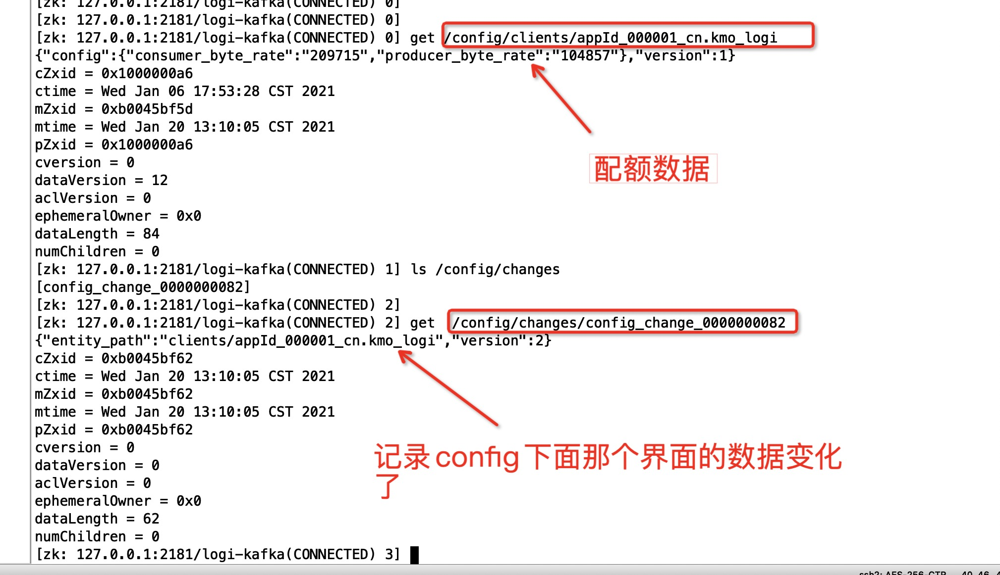

**步骤二：`Kafka-Broker`感知变化&更新配额**

因为`Kafka-Broker`会去监听`/config/changes`子节点的变化，因此当该节点变化时，`Kafka-Broker`会收到该通知，然后开始进行处理，具体如下图所示：

1、感知到变化节点变化之后开始进行处理：
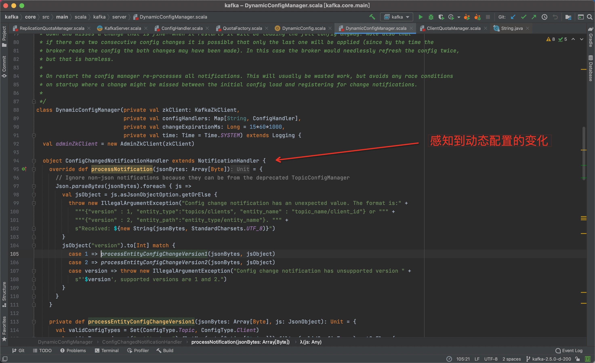

**步骤三：`Kafka-Broker`接受客户端请求并判断是否应该限流**

判断是否应该限流
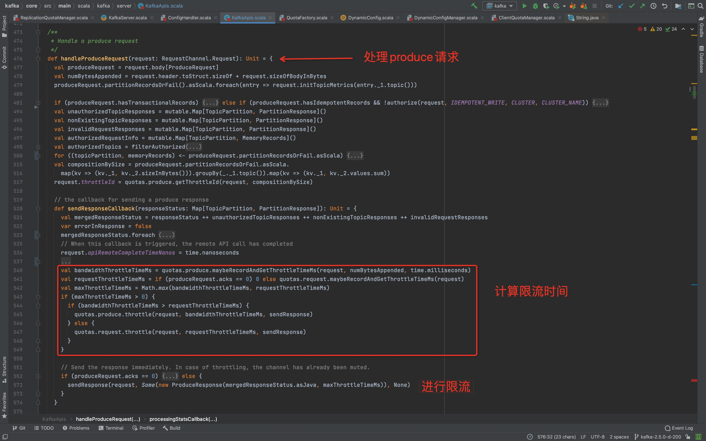

**步骤四：通锁住channel来进行限流**

锁住channel之后，原本应该返回给客户端的response将会被存在channel缓存中，同时因为channel被锁住，客户端此时也不能将请求发送过来。

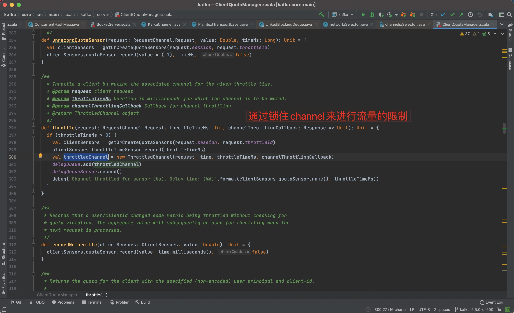

## 6、总结

本次分享大致介绍了`Logi-KafkaGateway`相关的实现方式，包括服务发现、安全管控、流量管控等。但是涉及到的源码没有进行细致的讲解说明。源码的走读，我们后续再进行。

谢谢大家。
